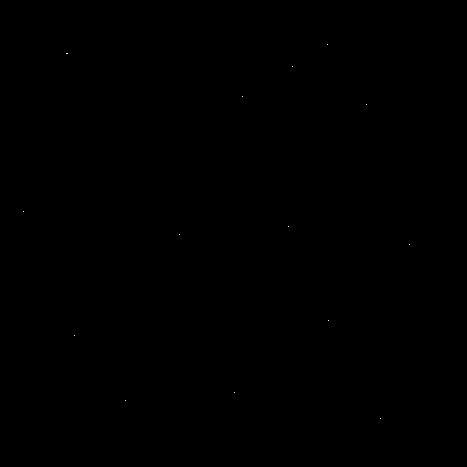
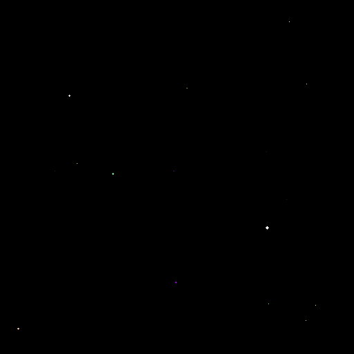
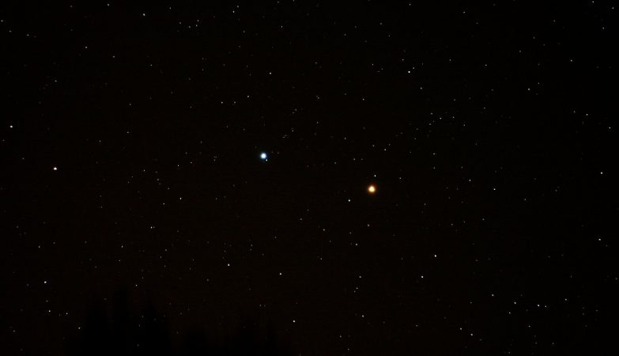

<h2 align = "center">
ESCOLA DE CIÊNCIAS E TECNOLOGIA
<br>
<br>
PROBABILIDADE E ESTATÍSTICA 
</h2>
<br>
<br>
<h3>
Professor : João Vital da Cunha Júnior 
<br>
Alunos : Lucas Maia Rezende Costa e Ariel Louise Queiros de Morais
</h3></h3>
<br>
<h1 align='center'> 
Contador de objetos emissores e/ou refletores de luz no espaço
</h1>

# Testes

## Primeiro teste
A seguinte imagem, possui 15 objetos, porém 19 pixels coloridos com cores a cima do padrão _light_condition_, ou seja, irão ser contados :



Resultado:
```console
Está secção possui: 19 objetos que emitem ou refletem luz
Aplicar filtro?[y/n]
y 
Está secção possui: 15 objetos que emitem ou refletem luz (Filtro aplicado)
```

Então esse teste teve 100% de êxito.


## Segundo teste

A seguinte imagem, possui 44 objetos, porém 5 objetos possuem mais de 1px² de área :


Resultado: 
```console
Está secção possui: 44 objetos que emitem ou refletem luz
Aplicar filtro?[y/n]
y
Está secção possui: 8 objetos que emitem ou refletem luz (Filtro aplicado)
```
Esse teste obteve uma contagem de 7 objetos a menos, devido a existência de um objeto com formato irregular.

## Terceiro teste

A seguinte imagem, foi retirada da internet[1] :

Resultado:
```console
Está secção possui: 1960 corpos celestes que emitem ou refletem luz
Aplicar filtro?[y/n]
y
Está secção possui: 1012 corpos celestes que emitem ou refletem luz (Filtro aplicado)
```
Devido aos dois objetos grandes (azul e laranja), que estão no centro da imagem, pode-se ocorrer uma determinada falha na contagem devido ao fator de correção, que pode retirar mais ou menos pixels dependendo do objeto.


## Referências
[1] - https://ciberia.com.br/uma-das-estrelas-mais-brilhantes-do-ceu-gira-tao-rapido-que-quase-se-autodestroi-25642
